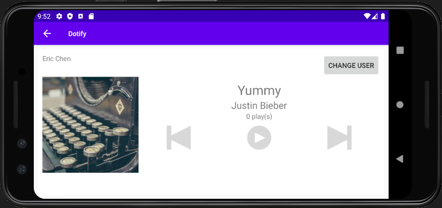

# Dotify
This is an app written in Kotlin for the Andriod Mobile Development class taught at the [University of Washington Information School](https://ischool.uw.edu/). 

You can watch a demo of the project by [clicking here](https://drive.google.com/file/d/1nFdHPyT48qQnZW-NT3cTAkgVYuS50npB/view?usp=sharing)

Author: Haoyang (Eric) Chen

## Description
This app shows a music player app that displays a list of songs. In this list, the users can see the album's cover, song titles, and artist names. The user can select a particular song in the list, and click on the mini-player container to view that particular song's album art, title, artist name, number of plays, and some media control buttons. The user can interact with the media control buttons to change users and increase the number of plays. The user can also utilize the previous or next media button to skip the song. By clicking on the Change User Button, the app also allows the user to change the user name and that name will remain consistent. Additionally, the app also has a shuffle feature with an animation effect to change the order of songs on the list.

## Implementation
Rebuilt the app using a single activity and fragments. Utilized activity lifecycle & back stack to ensure the consistency of data/state during the rotation of the phone. Created a landscape layout for the rotation. 

Utilized Android's Application class to store the data and keep track of the state of the data due to user interaction. Made an HTTP GET Request to get JSON from music library API and populate the data in the song list using GSON. Utilized [Picasso](https://square.github.io/picasso/) to load and show remote images.

## Screenshot
Screenshots of the app running on a device emulator

